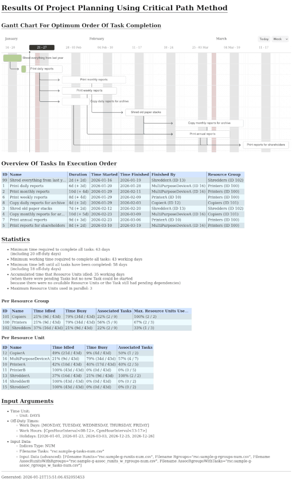

# Demo Application for the Critical Path Method Java Library for Project Planning

This is a demo application for the Critical Path Method Java library found at [https://github.com/tsitle/java_critical_path_method_library](https://github.com/tsitle/java_critical_path_method_library).

The purpose of the library is to compute the optimal order in which to perform the tasks of a project.  
To determine the optimal order, the library needs to know the resource requirements of each task.  
That includes which resources are available to perform the task and how long the task is expected to take.

In other words, the library (and this demo application) can be used to plan projects.

The application uses simple CSV files for all the input data and a JSON configuration file.  
And it can export the results to an HTML file – which includes a Gantt chart that visualizes the optimal order.

Also does the library take into account holidays, work days and work hours.

In theory, one could

- export the data from a database or something like Atlassian's Jira,
- store it in CSV files,
- use this application to compute the optimal order in which to perform the tasks of the project
- and then feed the results back into the database or Jira.

Also, one could use the results to identify bottlenecks in the project.  
For instance, you may find that you need to hire more people to complete the project in time.  
Or if your project requires machines, you may find that you need to buy more machines.

## Usage

Binary distribution releases of the app are available at [https://github.com/tsitle/java_critical_path_method_demo_app/releases](https://github.com/tsitle/java_critical_path_method_demo_app/releases).

```
cpm_demo [-hV] [--output-html=<outputHtmlFilename>] <configJsonFilename>

  -h, --help                          display this help message
  -V, --version                       display version info
  --output-html=<outputHtmlFilename>  optional: write results to an HTML file
  <configJsonFilename>                path to the JSON configuration file (may be prefixed with 'rsc:')
```

### Example #1 (using a released version of the app):

``` bash
./cpm_demo-linux-x64-1.0/bin/cpm_demo --output-html="output-sample-g.html" "rsc:config-g.json"
```

The prefix `rsc:` in the config filename indicates that the file is located in the Java resources folder  
and is therefore packaged with the application bundle.

### Example #2 (using a released version of the app):

If you want to use a custom configuration file:

``` bash
./cpm_demo-linux-x64-1.0/bin/cpm_demo --output-html="output-custom.html" "config_files/config.json"
```

### Example #3 (using Gradle to build the app from the source code and run it):

``` bash
./gradlew run --args="rsc:config-a.json"

or

./gradlew run --args="--output-html='output-sample-a.html' 'rsc:config-a.json'"
```

## Sample Screenshot of the HTML Output



## Configuration File

see [docs/config_file.md](docs/config_file.md)

## Input Files

see [docs/csv_files.md](docs/csv_files.md)
